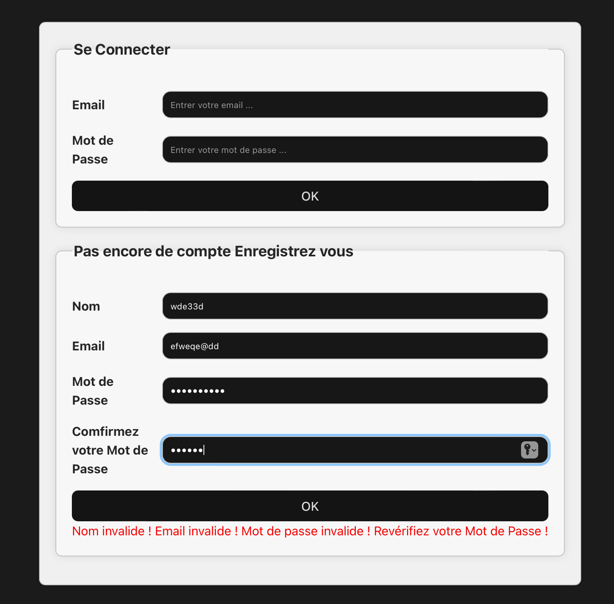
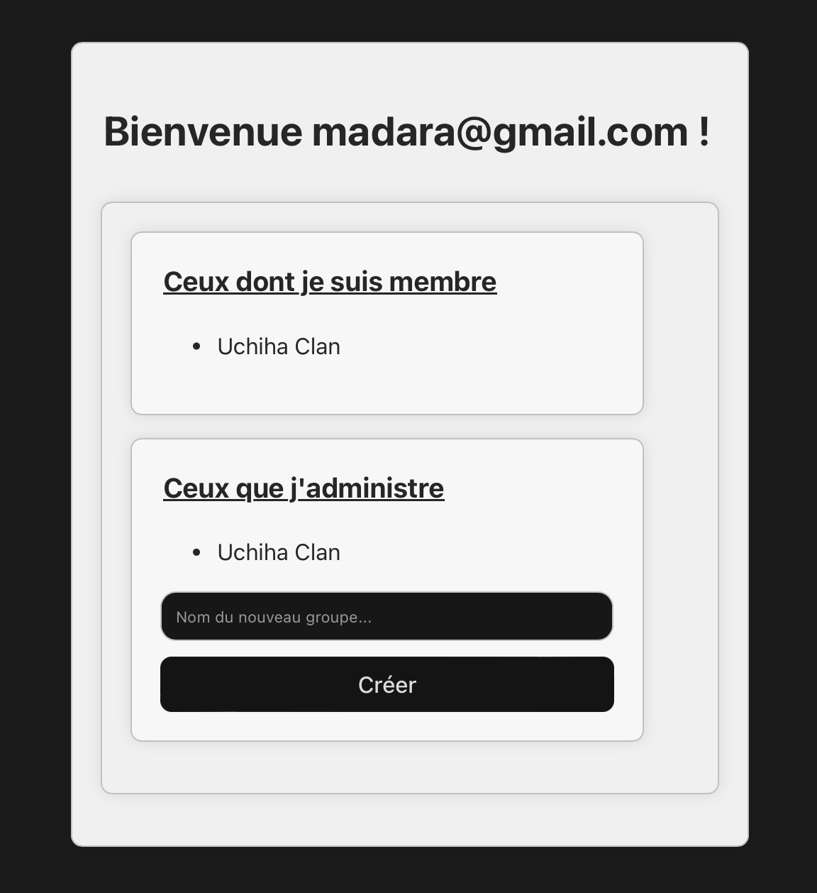

---
title: Projet React - link->https://wtspweb.osc-fr1.scalingo.io/frontend 
author:  
- Abdelhadi Nasmane
- Yassine Rjeb
--- 

## Cahier des charges

### Fonctionnalités souhaitées

#### Authentification :

DONE > Permettre aux utilisateurs de créer un compte : Les utilisateurs doivent pouvoir fournir des informations telles que leur nom, leur adresse e-mail et leur mot de passe pour créer un compte.

DONE > Permettre aux utilisateurs de se connecter à leur compte : Une fois un compte créé, les utilisateurs doivent pouvoir se connecter en utilisant leur adresse e-mail et leur mot de passe.

#### Gestion des groupes :

DONE > Permettre la création de nouveaux groupes : Les utilisateurs doivent pouvoir créer de nouveaux groupes en spécifiant un nom.

NOT DONE > Permettre aux utilisateurs de rejoindre des groupes existants : Les utilisateurs doivent pouvoir rechercher des groupes existants et demander à les rejoindre.

DONE > Permettre aux propriétaires de groupes de gérer les membres : Les propriétaires de groupes doivent pouvoir ajouter ou supprimer des membres.

NOT DONE > Permettre aux propriétaires de groupes de gérer leurs groupes : Les propriétaires de groupes doivent modifier le nom du groupe, et supprimer le groupe si nécessaire.

#### Messagerie :

DONE > Permettre l'échange de messages entre les membres d'un groupe : Les utilisateurs doivent pouvoir envoyer des messages textuels aux autres membres d'un groupe.

DONE > Afficher les messages dans l'ordre chronologique : Les messages doivent être affichés dans l'ordre chronologique de leur envoi.

NOT DONE > Permettre la suppression des messages par les utilisateurs autorisés : Les utilisateurs doivent pouvoir supprimer leurs propres messages, et les propriétaires de groupes doivent pouvoir supprimer tous les messages du groupe si nécessaire.

### Cas d'usage

A modifier/compléter 


### Captures d'écran

#### Page Principale


#### Creation de compte avec informations erronées


#### Creation d'un compte


#### login + Page d'acceuil


#### Creation d'un groupe


#### Gestion du groupe


#### Ajout de membres


#### Converation dans un groupe


#### Envoi de message


#### Reception de message (Uchiha Madara speech 1)


#### Reception de message (Uchiha Madara speech 2)


### API mise en place

lien vers documentation swagger: https://wtspweb.osc-fr1.scalingo.io/doc/

## Architecture du code

### FrontEnd

#### Composants de connexion (connect-components):
Ces composants sont responsables de l'interface utilisateur liée à la connexion et à la création de compte.

Acceuil.jsx: Ce composant représente la page affichée après le login réussit.

CreateAccount.jsx: Ce composant permet aux utilisateurs de créer un nouveau compte en fournissant leur nom, leur adresse e-mail et leur mot de passe.

LoginView.jsx: Ce composant gère le processus de connexion des utilisateurs existants en leur permettant de saisir leur adresse e-mail et leur mot de passe.

#### Composants de gestion de groupes (groups-components):
Ces composants gèrent l'interface utilisateur associée à la gestion des groupes, y compris la création, la suppression et la gestion des membres.

GroupsManager.jsx: Ce composant permet aux utilisateurs de gérer les groupes qu'ils possèdent. Il a comme sous composants SelectMembers.jsx qui gère la liste des utilisateurs proposée pour être ajouté à un groupe, et DeleteMembers.jsx qui gère la suppression des membres d'un groupe.

SelectMembers.jsx: Ce composant permet à l'utilisateur de sélectionner les membres à ajouter à un groupe existant.

DeleteMembers.jsx: Ce composant permet à l'utilisateur de supprimer les membres de son groupe, il est composé de plusieurs DeleteMember.jsx, chacun représentant un membre.

DeleteMember.jsx: Ce composant représente un membre appartenant à un groupe.

JoinedGroups.jsx: Ce composant affiche la liste des groupes dont l'utilisateur est un membre, il est composé de plusieurs JoinedGroup.jsx, chacun représentant un groupe.

JoinedGroup.jsx: Ce composant représente un groupe auquel l'utilisateur est membre.

OwnedGroups.jsx: Ce composant affiche la liste des groupes dont l'utilisateur est le créateur, il est composé de plusieurs OwnedGroup.jsx, chacun représentant un groupe.

OwnedGroup.jsx: Ce composant représente un groupe que l'utilisateur a créé.

#### Composants de gestion des messages (messages-components):
Ces composants gèrent l'interface utilisateur associée à l'envoi et à la réception de messages dans les groupes.

MessagesManager.jsx: Ce composant affiche la liste des messages dans un groupe spécifique et permet à l'utilisateur d'envoyer de nouveaux messages.

Message.jsx: Ce composant représente un message individuel dans une conversation de groupe. Il affiche le contenu du message, et potentiellement le nom de l'utilisateur qui l'a envoyé.

PostMessage.jsx: Ce composant permet à l'utilisateur d'écrire et d'envoyer un nouveau message dans la conversation du groupe.

### Backend

#### Schéma de votre base de donnée

A modifier/compléter...

```plantuml
class User{
  id
  name
  email
  passhash
  isAdmin : boolean
}

class Message{
  id
  content
  createdAt
  userId
  groupId
}

class Group{
  id
  name
  ownerId
}

User "1" -- "n" Message : posts
Group "1" -- "n" Message : contains

User "n" -- "n"  Group : is member 
User "1" -- "n"  Group : create and own
```

#### Architecture de votre code

##### Backend (backend/src):

###### Contrôleurs (controllers):
Ce dossier contient les fichiers qui définissent la logique métier de notre application backend.
Chaque fichier de contrôleur correspond généralement à une entité ou une fonctionnalité spécifique de notre application.
Par exemple, groups.js contient les fonctions pour gérer les opérations liées aux groupes, telles que la création, la récupération, la mise à jour et la suppression.

###### Modèles (models):
Dans ce dossier, nous définissons les modèles de données de notre application, qui représentent les entités stockées dans notre base de données.
Les modèles définissent la structure des données et les relations entre elles, ce qui facilite les opérations CRUD (Create, Read, Update, Delete).
Par exemple, groups.js définit le schéma d'un groupe avec ses attributs.

###### Routes (routes):
Les fichiers de ce dossier définissent les routes de l'API REST de notre application.
Chaque fichier de route correspond généralement à un ensemble de routes pour une entité ou une fonctionnalité spécifique.
Par exemple, groups.js contenient les définitions des routes pour les opérations liées aux groupes.

###### Utilitaires (util):
Ce dossier contient des utilitaires ou des fonctions réutilisables qui ne sont pas spécifiques à une fonctionnalité particulière mais qui sont nécessaires à plusieurs endroits de notre application backend.
Par exemple, logger.js contient des fonctions pour enregistrer des messages de journalisation dans la console.

###### Fichier principal (app.js et server.js):
Ce fichier est le point d'entrée de notre application backend.
Il est responsable de démarrer le serveur Express.
C'est là que nous définissons les routes, les gestionnaires d'erreurs, etc., pour gérer les requêtes HTTP entrantes et retourner les réponses appropriées.

### Gestion des rôles et droits

#### Coté backend

Ici on autorise l'accès à tous.

#### Coté frontend

Le backend ne fourni dans ses réponse que le nécessaire, on ne fourni pas des information sensible, c'est à un dire un utilisateur ne peux pas voir ce qui ce passe dans les autres groupes. Cependant l'endpoint qui fourni cette information est encors ouvert, si Mr Hacker le trouve... en tout cas on l'a laissé puisque l'énoncé du TP Backend demande cela.

## Test

### Backend

#### Test de connexion et de liste d'utilisateurs

Ce test vérifie si un utilisateur peut se connecter avec succès et obtenir la liste des utilisateurs. Il teste également les cas où le token est manquant ou invalide.

#### Test de création de compte et de connexion, de mise à jour du mot de passe, et de connexion avec l'ancien mot de passe

Ce test vérifie la création d'un compte utilisateur, la connexion réussie, la mise à jour du mot de passe, et le cas où l'utilisateur essaie de se connecter avec l'ancien mot de passe après la mise à jour.

#### Test de connexion avec des informations invalides

Ce test couvre les cas où l'utilisateur essaie de se connecter sans email ni mot de passe, avec un email incorrect ou un mot de passe incorrect.

#### Test de création d'utilisateur avec des informations invalides

Ce test vérifie les différents scénarios où la création d'un nouvel utilisateur échoue en raison d'informations invalides, telles qu'un email invalide, un nom invalide ou un mot de passe faible.

#### Test des fonctionnalités d'administration

Ce test couvre les opérations d'administration, telles que la mise à jour des informations utilisateur (mot de passe, email, nom, isAdmin) et la suppression d'utilisateurs.

#### Test de tentative d'utilisation du token par un utilisateur supprimé par l'administrateur

Ce test vérifie le comportement lorsque l'administrateur supprime un utilisateur et que cet utilisateur tente toujours d'utiliser son token.

#### Test de création de groupe et d'ajout/liste de membres

Ce test couvre la création d'un groupe, l'ajout de membres au groupe et la liste des membres du groupe. Certains tests associés à la gestion des membres ont été commentés après l'ajout de fonctionnalités de websockets.

#### Test des messages

Ce test vérifie la création et la récupération de messages dans un groupe. Certains tests associés à la gestion des messages ont également été commentés après l'ajout de fonctionnalités de websockets.

#### Couverture

Ces tests fournissent une couverture de 100% sur les fichiers du backend qu'on a écrit (Avant l'ajout des websockets).

### Frontend

#### connect

##### Test d'inscription (Register)
Ce test vérifie le processus d'inscription en remplissant le formulaire avec des informations valides, telles qu'un nom, un email unique généré aléatoirement, et un mot de passe valide. Il vérifie également que le message de succès est affiché après l'inscription et que l'email est pré-rempli dans la vue de connexion.

##### Test d'inscription avec un email existant (Register with existing email)
Ce test vérifie le scénario où un utilisateur tente de s'inscrire avec un email qui existe déjà dans la base de données. Il vérifie que le message d'échec est affiché après la tentative d'inscription.

##### Test d'inscription avec des informations invalides (Register invalid info)
Ce test vérifie différents scénarios où l'utilisateur fournit des informations invalides lors de l'inscription, telles qu'un nom invalide, un email invalide et un mot de passe invalide. Il vérifie que les messages d'erreur appropriés sont affichés.

##### Test de connexion avec des informations invalides (Login invalid info)
Ce test vérifie les cas où l'utilisateur fournit des informations de connexion invalides, comme un email invalide et un mot de passe invalide. Il vérifie que les messages d'erreur appropriés sont affichés.

##### Test de connexion avec des informations incorrectes (Login with incorrect info)
Ce test vérifie le cas où l'utilisateur fournit des informations de connexion correctes mais incorrectes, telles qu'un email correct mais un mot de passe incorrect. Il vérifie que le message d'échec de connexion est affiché.

##### Test de connexion (Login)
Ce test vérifie le processus de connexion en utilisant les informations d'inscription valides précédemment fournies. Il vérifie que l'utilisateur est redirigé vers la page d'accueil après une connexion réussie.

#### groups

##### Inscription, connexion et test des fonctionnalités de groupe
Ce test vérifie le processus d'inscription et de connexion d'un utilisateur, puis teste les fonctionnalités de groupe. Après avoir visité la page, il saisit les informations d'inscription, crée un compte, se connecte avec succès, et crée un nouveau groupe avec un nom généré aléatoirement. Ensuite, il vérifie que le groupe créé apparaît à la fois dans la liste des groupes appartenant à l'utilisateur et dans la liste des groupes auxquels il a rejoint. Il vérifie également que les éléments de gestion du groupe sont présents, et que la liste des membres du groupe est vide au début. Ensuite, il ajoute un membre au groupe, vérifie qu'il a été ajouté avec succès, puis le supprime et vérifie que la liste des membres est à nouveau vide.

#### messages

##### Inscription, connexion et test des fonctionnalités de messages
Ce test vérifie le processus d'inscription et de connexion d'un utilisateur, puis teste les fonctionnalités de messagerie. Après avoir visité la page, il saisit les informations d'inscription, crée un compte, se connecte avec succès, et crée un nouveau groupe avec un nom généré aléatoirement. Ensuite, il vérifie que les éléments de messagerie sont présents en cliquant sur le groupe créé et en vérifiant l'apparition du groupe dans la légende. Il saisit un message et vérifie qu'il a été posté avec succès. Ensuite, un deuxième utilisateur est créé. Le premier utilisateur se connecte et ajoute le deuxième utilisateur au groupe précédemment créé. Le deuxième utilisateur se connecte ensuite et envoie un message. Enfin, le premier utilisateur se connecte à nouveau pour lire le message du deuxième utilisateur, vérifiant que le message et le nom de l'utilisateur apparaissent correctement.

## Intégration + déploiement (/3)

#### lint-js:
Ce job effectue le linting du code JavaScript du backend en utilisant ESLint. Il génère un rapport des erreurs de linting dans un fichier lintes_report.txt.
#### super-test:
Ce job teste les fonctionnalités du backend en exécutant la documentation et les tests unitaires. Il génère un rapport de couverture des tests dans un fichier testCover_report.txt.
#### semgrep:
Ce job effectue une analyse statique de sécurité du backend en utilisant Semgrep. Il génère un rapport des résultats de l'analyse dans un fichier testSecurity_report.txt.
#### frontend-css:
Ce job effectue le linting du fichier css App.css. Il génère un rapport des erreurs de linting dans un fichier lintcss_report.txt. Le linter utilisé est un peu vieux, c'est pour cela qu'il y a des erreurs de type 'Don't use ID as a selector'.
#### frontend-cypress:
Ce job teste les fonctionnalités du frontend en utilisant Cypress. Il nettoie la base de données, démarre le serveur backend et frontend localement, puis exécute les tests Cypress.
#### badges:
Ce job génère des badges à afficher dans notre projet, basés sur les résultats des jobs précédents.
#### scalingo:
Ce job déploie notre application sur Scalingo. Il configure l'environnement, installe les dépendances, génère la version de production du frontend, puis déploie le backend et le frontend sur Scalingo.

## Installation
Pour lancer le backend/frontend localement:

#### Dans un terminal (1)
cd /cheminVersDepot

cd backend

npm i

npm run updatedb

npm run startdev

#### Ouvrir un autre terminal (2)
cd /cheminVersDepot

cd frontend

npm i

npm run dev

#### Dans un navigateur:
ouvrir le lien: http://localhost:5173/
```